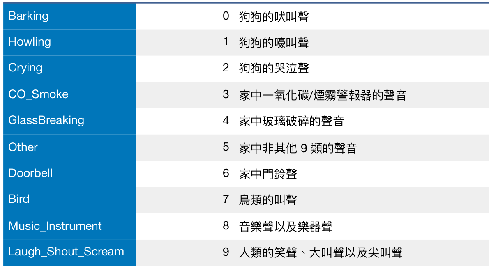

# Tomofun-Challenge-Audio-Classificaiton

This is a repository for our implementation of Tomofun 狗音辨識 AI 百萬挑戰賽 in the final challenge, an audio classification challenge focusing on dog sounds and noises inside the house.

We are team ADEE. Our ranking for the competition are : 

Preliminary : 24 / 301 roc_auc : 0.9816 (First place : 0.9899)

Final 8 / 25 roc_auc : 0.9419 (First place : 0.9605)

## Task Description
The dataset consists of 5 second wav files. They are categorized into ten categories.



The final test set is served using an api call on Amazon Sagemaker, therefore we do not have the data, this repository focuses on solving the task locally.

## Dataset preperation

We run our code with both a fraction of AudioSet and Tomofun data. Since the latter is not publically availible, we demonstrate how to run with AudioSet only.
Download  ```audioset_train_strong.tsv``` and ```mid_to_display_name.tsv``` from AudioSet. (https://research.google.com/audioset/download_strong.html)
Place it ```under data/AudioSet```

Execute
```
python ./scripts/quick_merge.py
```

Then, download the youtube files using
```
python ./scripts/download_sound_all.py
```
We only download instances that have a corresponding category in the tomofun dataset. The mapping is shown in the python file.
Note : If your are cotraining with Tomofun data, download roughly 3000 data in total, otherwise download as many as you like. The audio files will be stored at ```./data/AudioSet/raw```

Finally, run 
```
python ./scripts/gen_meta_train_audioset.py
```
to generate the meta_train.csv file. The csv structure is identical to the Tomofun Data.

If you have the Tomofun data, restructure the directories, such the under ```./data/Final_Training_Dataset```, the ```raw``` folder contains directly the wav files and create a ```feats``` folder. (for caching features)


## Training

Requirements : 
```pip install colorednoise resampy SoundFile torch shutil```

To run training on Tomofun data,
```
python ./src/run_classification_verbose_classes_final.py
```
You can change ```AudioDatasetFinalClasses("train")``` to ```AudioDatasetFinalClasses("AudioSet")``` to run on AudioSet instead.

To run training on both Tomofun data and AudioSet,

```
python ./src/run_classification_verbose_classes_final_extra_data.py
```

## Testing

Testing is originally done using api on the file ```./src/serve```. A local tester can be runned using 
```python ./src/serve-local.py``` 


## Implementation

We used torchvggish (https://github.com/harritaylor/torchvggish), which is a pytorch checkpoint of the VGG model pretrained on the AudioSet.

We applied attention pooling to the output features, and apply different softmax temperature at testing phase to find the best ROC_AUC.

For data augmentation, we shift the wav in the time domain by at most 1 second. We also used colorednoise generated sound as extra data in the "Other" category.

The class "Other" is tagged to multiple categorized sounds in the Tomofun dataset, so we decided to separate the classes in training, and merge them in validation/testing.

We tested the addition of extra data in three experiments. The first one is to add all the data parsed in the AudioSet, the second one is to only add Non-dog samples from AudioSet, and the third one is to only add Dog samples from the AudioSet. We found that only added Non-dog samples from AudioSet yield best results.

This code snippet from ```./src/run_classification_verbose_classes_final_extra_data.py``` selects the sample used from AudioSet
```
idx_audioset = []
print(len(dset2))
for n,(_,l) in enumerate(dset2):
	if l not in [0,1,2]: # Change this to filter the data of the second training set
		idx_audioset.append(n)
	if n == len(dset2) - 1:
		break
print(idx_audioset) 
idx_audioset = [x+len(dset) for x in idx_audioset]

```
